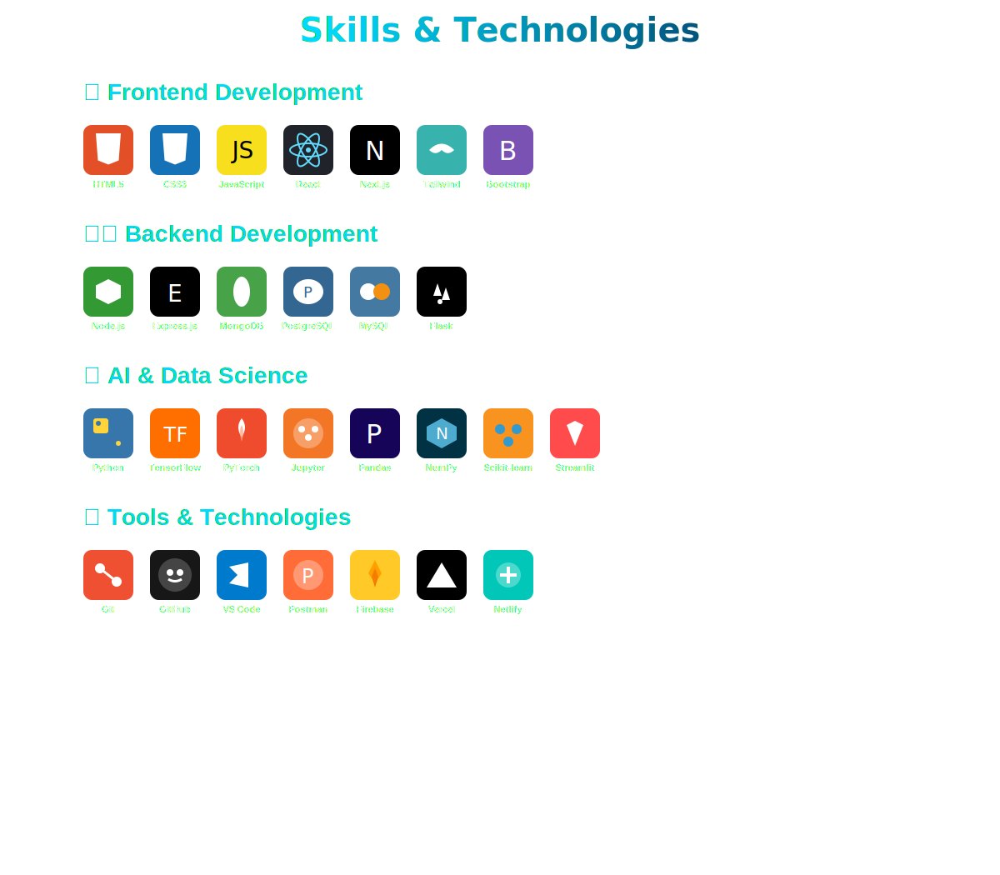

---

---

---

---

---

---

▸  [Deep Learning & Generative AI](https://github.com/AfsanaMim9639/Deep-Learning-Generative-AI)

▸  [Machine Learning Projects](https://github.com/AfsanaMim9639/Machine-Learning-Projects)

▸  [ML Assignment Collection](https://github.com/AfsanaMim9639/ML-Assignment)

▸  [CareNest - Healthcare Management System](https://github.com/AfsanaMim9639/carenest)

▸  [TechHub - Technology Platform](https://github.com/AfsanaMim9639/techHub)

---

**[🔗 Live Demo](https://carenest-sywa.vercel.app/)** | **[📂 Repository](https://github.com/AfsanaMim9639/carenest)**

---

**[🔗 Live Demo](https://ecotrack-71dcf.web.app/)** | **[📂 Repository](https://github.com/AfsanaMim9639/ecotrack-client)**

---
---

### 🌍 EcoTrack - Environmental Monitoring

**🔗 Live Link:** [EcoTrack Live](https://ecotrack-app.web.app)

**💻 Technologies:** React, Node.js, MongoDB, Chart.js, Leaflet Maps, Tailwind CSS

**✨ Key Features:**
- 🌱 Track environmental data and pollution levels
- 📊 Data visualization with interactive charts
- 🗺️ Location-based environmental monitoring
- 📱 Responsive design for mobile and desktop
- 🔔 Real-time alerts for environmental hazards

---

## 💡 Random Dev Quote

---

## 📈 Visitor Count

---

### ⭐ Show some love by starring my repositories!

