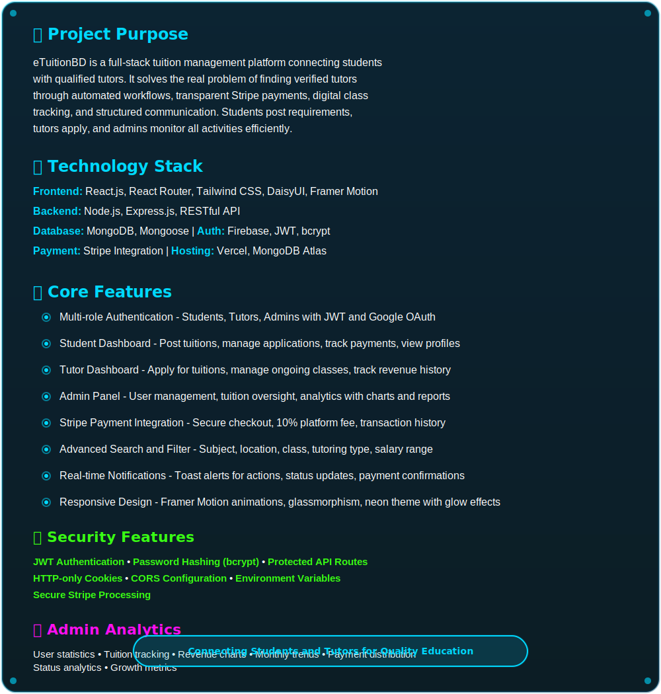
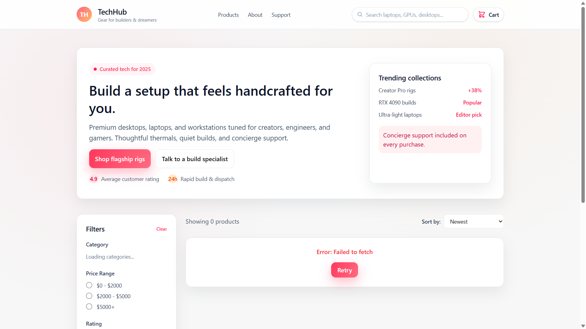
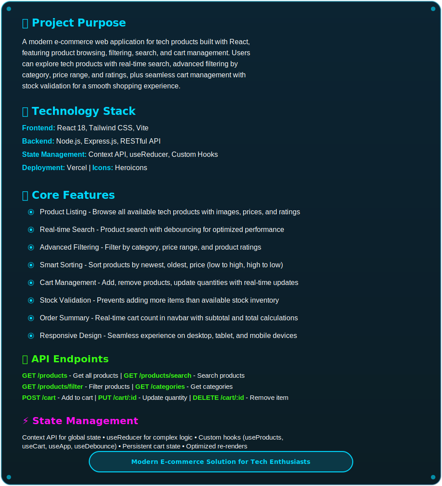
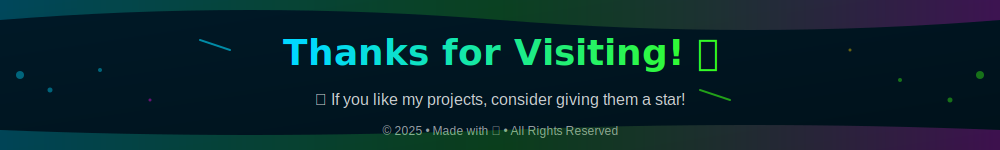

---

---

---

---

## 🌐 Connect With Me

---

**Alternative Animated Style:**

<table>
<tr>
<td align="center" width="150">
<a href="https://www.linkedin.com/in/afsana-mim-878638193/">

 
<b>LinkedIn</b>
</a>
</td>

<td align="center" width="150">
<a href="https://github.com/AfsanaMim9639">

 
<b>GitHub</b>
</a>
</td>

<td align="center" width="150">
<a href="https://www.facebook.com/afsana.mim.453404">

 
<b>Facebook</b>
</a>
</td>
</tr>

<tr>
<td align="center" width="150">
<a href="https://wa.me/8801949009639">

 
<b>WhatsApp</b>
</a>
</td>

<td align="center" width="150">
<a href="https://discord.com/users/afsanamim0944">

 
<b>Discord</b>
</a>
</td>

<td align="center" width="150">
<a href="mailto:afsanamim813@gmail.com">

 
<b>Gmail</b>
</a>
</td>
</tr>
</table>

---

**Simple Text Links Style:**

📧 **Email:** [afsanamim813@gmail.com](mailto:afsanamim813@gmail.com)  
💼 **LinkedIn:** [Afsana Mim](https://www.linkedin.com/in/afsana-mim-878638193/)  
💻 **GitHub:** [@AfsanaMim9639](https://github.com/AfsanaMim9639)  
📘 **Facebook:** [Afsana Mim](https://www.facebook.com/afsana.mim.453404)  
💬 **WhatsApp:** [+880 194 900 9639](https://wa.me/8801949009639)  
🎮 **Discord:** afsanamim0944

---

---

<table>
<tr>
<td width="50%">

### 🏥 Full-Stack Web Applications
- 🏥 **[CareNest](https://github.com/AfsanaMim9639/carenest)**  
  Healthcare Management System
  
- 💰 **[EchoTrack](https://github.com/AfsanaMim9639/EchoTrack)**  
  Expense Tracker Application
  
- 📚 **[eTuitionBD](https://github.com/AfsanaMim9639/eTuitionBD)**  
  Tuition Management Platform
  
- 🛒 **[TechHub](https://github.com/AfsanaMim9639/techHub)**  
  E-commerce Technology Platform

</td>
<td width="50%">

### 🤖 AI & Machine Learning
- 🧠 **[Deep Learning & Generative AI](https://github.com/AfsanaMim9639/Deep-Learning-Generative-AI)**  
  Advanced AI/ML Projects
  
- 📊 **[Machine Learning Projects](https://github.com/AfsanaMim9639/Machine-Learning-Projects)**  
  ML Implementations
  
- 📝 **[ML Assignment Collection](https://github.com/AfsanaMim9639/ML-Assignment)**  
  Academic ML Work

</td>
</tr>
</table>

---

**[🔗 Live Demo](https://carenest-sywa.vercel.app/)** | **[📂 Repository](https://github.com/AfsanaMim9639/carenest)**

---

**[🔗 Live Demo](https://ecotrack-71dcf.web.app/)** | **[📂 Repository](https://github.com/AfsanaMim9639/ecotrack-client)**

---

**[🔗 Live Demo]([your-live-link](https://etuitionbd-b9b1d.web.app/)** | **[📂 Client Repo](https://github.com/AfsanaMim9639/eTuition-client)** 

---

  

**[🔗 Live Demo](https://tech-hub-gamma-five.vercel.app/)** | **[📂 Repository](https://github.com/AfsanaMim9639/techHub.git)**

---

---

